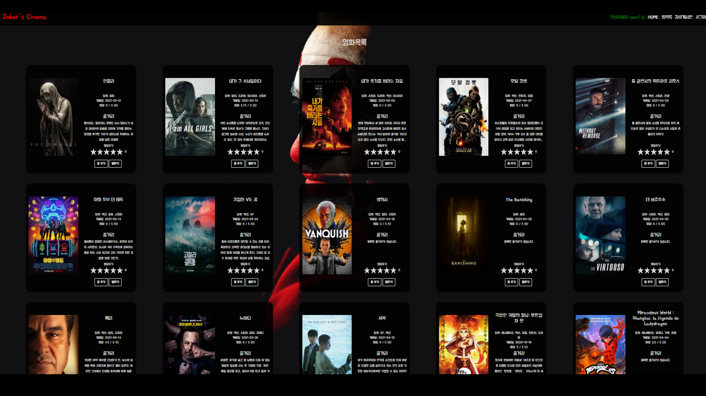
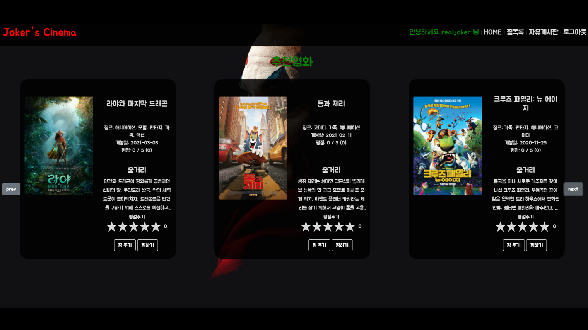
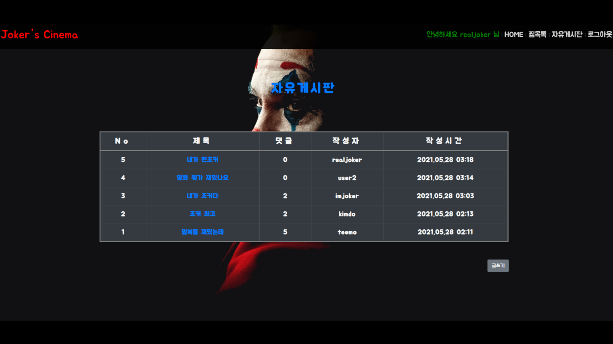
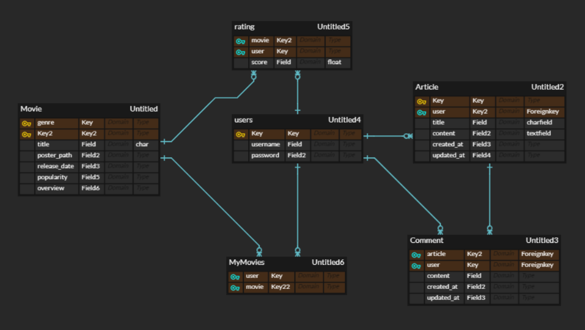

# final-pjt

#### 1. 팀원 정보 및 업무 분담 내역

- 김도형 : 백엔드 / 프론트엔드
  - erd 설계
  - django API Server 개발
  - server-client 통신 / state 관리
- 최준성: 프론트엔드
  - FE 구조 설계
  - UI 디자인
  - Vue, Css, Bootstrap 활용 UI 구현

#### 2. 개발 환경 및 사용 기술

- BackEnd

  - Python 3.8.9

  - Django 3.2.3

    - django rest framework 

    - JWT 인증

    - TMDB api 활용하여 영화데이터 수집

      

- FrontEnd

  - Javascript ES 6
  - Vue.js 2.6.12
    - axios
    - bootstrap-vue 2.21.2
    - vue-glide-js 1.3.14
    - vue-router 3.2.0
    - vue-star-rating 1.7.0
    - vuex 3.4.0
    - vuex-persistedstate 4.0.0

#### 3. 목표 서비스 구현

  - 영화정보
    
    - TMDB 영화정보 API를 활용해 최신 영화 및 추천 영화 정보 제공(120개)
    - 로그인된 유저의 영화 평점 작성 가능 
  - 추천 알고리즘
    
    - 유저가 높은 평점을 준 영화(4.0 초과), 찜한 영화들의 모든 장르를 수집 
    - 해당 유저의 장르 선호도를 판단
    - 선호 장르의 영화들 중 이미 평점을 주거나 찜한 영화를 제외한 영화들을 평점 순으로 추천
    - 비로그인 유저 / 데이터가 없는 유저는 관람객 순으로 15개영화 추천
  - 커뮤니티 기능
    
    - 게시글 생성, 삭제
    - 게시글에 대한 댓글 생성 삭제

#### 4. 데이터베이스 모델링(ERD)

#### 5.  핵심 기능

- vue-router를 활용한 SPA 구현
  - 몇몇 기능에서 새로고침이 발생(수정 필요)
- vue glide활용해 자연스러운 영화정보 카드 이동
  -  홈화면 1번째줄:  개봉일 순으로 최신영화 카드
  -  홈화면 2번째줄: 사용자별 맞춤 영화 추천
  - 아래로 전체영화 나열 
- 평점주기 기능 : 0.5~5.0 점 별점 주기 가능
- 찜하기 기능: 찜하기 클릭시 찜목록으로 영화카드 이동
- 영화 추천 알고리즘
  - 유저 활동으로 추출한 선호 장르 기반 추천
- 자유게시판 기능

